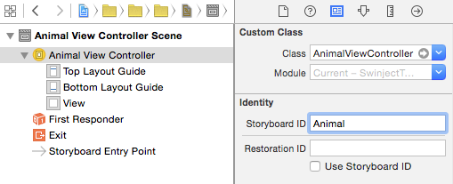
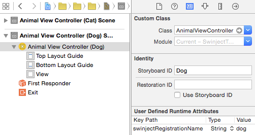

# Storyboard

Swinject supports dependency injection to view controllers instantiated by `SwinjectStoryboard`, which inherits `UIStoryboard` (or `NSStoryboard` in case of OS X). To register dependencies of a view controller, use `registerForStoryboard` method. In the same way as a registration of a service type, a view controller can be registered with or without a name.

**Note**: Do **NOT** explicitly resolve the view controllers registered by `registerForStoryboard` method. The view controllers are intended to be resolved by `SwinjectStoryboard` implicitly.

## Registration

### Registration without Name

Here is an example to simply register a dependency of a view controller without a registration name.

    let container = Container()
    container.registerForStoryboard(AnimalViewController.self) { r, c in
        c.animal = r.resolve(AnimalType.self)
    }
    container.register(AnimalType.self) { _ in Cat(name: "Mimi") }

Then create an instance of `SwinjectStoryboard` with the container specified. If the container is not specified, `SwinjectStoryboard.defaultContainer` is used instead. `instantiateViewControllerWithIdentifier` method creates an instance of the view controller with its dependencies injected:

    let sb = SwinjectStoryboard.create(
        name: "Animals", bundle: nil, container: container)
    let controller = sb.instantiateViewControllerWithIdentifier("Animal")
        as! AnimalViewController
    print(controller.animal! is Cat) // prints "true"
    print(controller.animal!.name) // prints "Mimi"

Where the classes and protocol are:

    class AnimalViewController: UIViewController {
        var animal: AnimalType?

        required init?(coder aDecoder: NSCoder) {
            super.init(coder: aDecoder)
        }
    }

    protocol AnimalType {
        var name: String { get set }
    }

    class Cat: AnimalType {
        var name: String

        init(name: String) {
            self.name = name
        }
    }

and the storyboard named `Animals.storyboard` has `AnimalViewController` with storyboard ID `Animal`.

### Registration with Name

If a storyboard has more than a view controller with the same type, dependencies should be registered with registration names.

    let container = Container()
    container.registerForStoryboard(AnimalViewController.self, name: "cat") {
        r, c in c.animal = r.resolve(AnimalType.self, name: "mimi")
    }
    container.registerForStoryboard(AnimalViewController.self, name: "dog") {
        r, c in c.animal = r.resolve(AnimalType.self, name: "hachi")
    }
    container.register(AnimalType.self, name: "mimi") {
        _ in Cat(name: "Mimi")
    }
    container.register(AnimalType.self, name: "hachi") {
        _ in Dog(name: "Hachi")
    }

Then view controllers are instantiated with storyboard IDs similarly to the case without registration names.

    let sb = SwinjectStoryboard.create(
        name: "Animals", bundle: nil, container: container)
    let catController = sb.instantiateViewControllerWithIdentifier("Cat")
        as! AnimalViewController
    let dogController = sb.instantiateViewControllerWithIdentifier("Dog")
        as! AnimalViewController
    print(catController.animal!.name) // prints "Mimi"
    print(dogController.animal!.name) // prints "Hachi"

Where `Dog` class is:

    class Dog: AnimalType {
        var name: String

        init(name: String) {
            self.name = name
        }
    }

and the storyboard named `Animals.storyboard` has `AnimalViewController`s with storyboard IDs `Cat` and `Dog`. In addition to the storyboard IDs, user defined runtime attributes are specified as `cat` and `dog` for the key `swinjectRegistrationName`, respectively.

## UIWindow and Root View Controller Instantiation

### Implicit Instantiation from "Main" Storyboard

If you implicitly instantiate `UIWindow` and its root view controller from "Main" storyboard, implement `setup` class method as an extension of `SwinjectStoryboard` to register dependencies to `defaultContainer`. When the root view controller (initial view controller) is instantiated by runtime, dependencies registered to `defaultContainer` are injected.

    extension SwinjectStoryboard {
        class func setup() {
            let container = defaultContainer
            container.registerForStoryboard(AnimalViewController.self) { r, c in
                c.animal = r.resolve(AnimalType.self)
            }
            container.register(AnimalType.self) { _ in Cat(name: "Mimi") }
        }
    }

### Explicit Instantiation in AppDelegate

If you prefer explicit instantiation of UIWindow and its root view controller, instantiate `SwinjectStoryboard` with a container in `application:didFinishLaunchingWithOptions:` method.

    @UIApplicationMain
    class AppDelegate: UIResponder, UIApplicationDelegate {
        var window: UIWindow?
        var container: Container = {
            let container = Container()
            container.registerForStoryboard(AnimalViewController.self) { r, c in
                c.animal = r.resolve(AnimalType.self)
            }
            container.register(AnimalType.self) { _ in Cat(name: "Mimi") }
            return container
        }()

        func application(
            application: UIApplication,
            didFinishLaunchingWithOptions launchOptions: [NSObject: AnyObject]?) -> Bool
        {
            let window = UIWindow(frame: UIScreen.mainScreen().bounds)
            window.makeKeyAndVisible()
            self.window = window

            let storyboard = SwinjectStoryboard.create(name: "Main", bundle: nil, container: container)
            window.rootViewController = storyboard.instantiateInitialViewController()

            return true
        }
    }

Notice that you should delete `Main storyboard file base name` item (or `UIMainStoryboardFile` item if you are displaying raw keys/values) in `Info.plist` of your app.

## Storyboard References

Storyboard Reference introduced with Xcode 7 is supported by `SwinjectStoryboard`. To enable dependency injection when an instance is created from a referenced storyboard, register dependencies to `defaultContainer` static property of `SwinjectStoryboard`.

    let container = SwinjectStoryboard.defaultContainer
    container.registerForStoryboard(AnimalViewController.self) { r, c in
        c.animal = r.resolve(AnimalType.self)
    }
    container.register(AnimalType.self) { _ in Cat(name: "Mimi") }

If you implicitly instantiate `UIWindow` and its root view controller, the registrations setup for "Main" storyboard can be shared with the referenced storyboard since `defaultContainer` is configured in `setup` method.

_[Table of Contents](README.md)_
